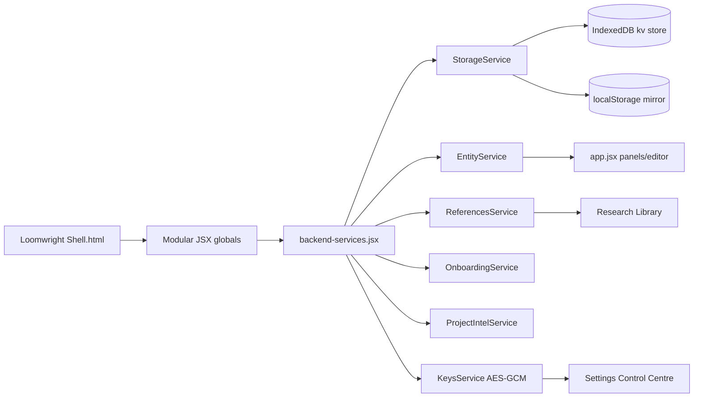

# Loomwright v2 Backend Implementation Guide

## Source of Truth

Use `Loomwright Shell.html` and the `.jsx` / `.css` files it loads. `index.html` redirects to the shell. Do not edit `Loomwright.bundle.jsx`; it is not part of the shell load path.

The shell is a static React 18 + Babel app. Files are loaded as globals, so backend integration lives in `backend-services.jsx` and is exposed through `window.LoomwrightBackend` plus convenience globals (`StorageService`, `EntityService`, `ReferencesService`, `OnboardingService`, `ProjectIntelService`, `KeysService`).

## Current Load Order Notes

`Loomwright Shell.html` loads React, ReactDOM, Babel, then modular JSX files including:

- Core: `brand.jsx`, `icons.jsx`, `primitives.jsx`, `shell-parts.jsx`, `layout-state.jsx`
- Entity data/framework: `entity-data.jsx`, `rpg-entities.jsx`, `entity-framework*.jsx`, `entity-editor*.jsx`
- Panels: `cast.jsx`, `upgrades-*.jsx`, `relationships.jsx`, `timeline.jsx`, `lore-references.jsx`, `panel-stack.jsx`
- Workspaces: `workspace.jsx`, `full-workspaces.jsx`, `workspaces-rpg.jsx`, `workspaces-narrative.jsx`, `workspaces-system.jsx`
- Settings/AI: `settings-rich.jsx`, `ai-handoff.jsx`
- Writer's Room: inline script inside `Loomwright Shell.html`
- Backend services: `backend-services.jsx`
- Mount: `app.jsx`

`vite.config.js` serves `.jsx` files as raw text during `npm run dev` so Babel Standalone receives the same modular source that a plain static server would serve.

## Backend Architecture



### Storage Keys

- `entities`
- `references`
- `onboarding_answers`
- `project_intelligence`
- `settings`
- `ai_provider_settings`
- `api_keys_encrypted`
- `review_queue`
- `manuscript`
- `composition_overlay`
- `ai_handoff_log`
- `trash`

All keys are stored under the `lw:v2:` localStorage prefix and mirrored in IndexedDB database `loomwright-v2`.

## Data Models

### Entity Base

```json
{
  "id": "string",
  "type": "cast|locations|items|quests|events|stats|references|...",
  "name": "string",
  "aliases": ["string"],
  "summary": "string",
  "description": "string",
  "status": "active|archived|draft|deleted",
  "flags": ["string"],
  "tags": ["string"],
  "sourceMentions": [
    { "chapter": "string", "paragraph": 1, "quote": "string" }
  ],
  "reviewQueueCount": 0,
  "createdAt": "timestamp",
  "updatedAt": "timestamp"
}
```

### Supported Entity Types

- `cast`: identity, appearance, class/race, stats, skills, equipment, relationships, timeline
- `bestiary`: species, threat level, habitat, abilities, weaknesses, encounters
- `locations`: hierarchy, region/type, linked quests/events, entities present
- `items`: slot, owner, location, rarity, condition, effects, history
- `quests`: type, status, goal, participants, locations, steps, rewards
- `events`: time, cause/effect, participants, linked quests/items/factions/stat changes
- `stats`: bounds, format, extraction rules, applies-to, history
- `references`: file/URL/note/style/canon source, content, links, AI inclusion

### Project Intelligence

```json
{
  "projectFoundation": "string",
  "writingStyleGuide": "string",
  "toneKeywords": ["string"],
  "canonRules": ["string"],
  "characterSummaries": [{ "entityId": "string", "summary": "string" }],
  "extractionRules": [{ "entityType": "string", "rule": "string" }],
  "privacySettings": {},
  "lastUpdated": "timestamp"
}
```

### AI Handoff Pack

```json
{
  "id": "uuid",
  "schema": "loomwright/ai-handoff/v1",
  "purpose": "scene|chapter|outline|continuity|entity",
  "detailLevel": "minimal|balanced|full|custom",
  "selectedEntities": [{ "id": "string", "type": "string", "name": "string", "role": "string" }],
  "contextOptions": {},
  "projectContext": {},
  "constraints": { "excludeDormant": true },
  "expectedReturnShape": {},
  "ts": 0
}
```

## Services

### StorageService

```js
await StorageService.get(key, fallback);
await StorageService.set(key, value);
StorageService.getSync(key, fallback);
await StorageService.getAll();
await StorageService.setAll(data);
await StorageService.clear();
```

### EntityService

```js
EntityService.listSync(type);
EntityService.getSync(id, type);
await EntityService.save(type, fields, { status: "draft"|"active" });
await EntityService.update(type, id, patch);
await EntityService.delete(type, id);
EntityService.decoratePanel(panel);
```

### References / Onboarding / Project Intelligence

```js
await ReferencesService.save({ kind, title, content, aiContext });
await OnboardingService.save(answers);
await ProjectIntelService.save(intel);
await ProjectIntelService.mergeFromOnboarding(answers);
```

### BYOK Key Storage

`KeysService` encrypts user-provided keys with Web Crypto AES-GCM before storing them in local storage/IndexedDB. The encryption root is a non-extractable `CryptoKey` kept in the browser's IndexedDB keyring store, not mirrored into localStorage:

```js
await KeysService.saveProvider("openai", {
  enabled: true,
  model: "gpt-4o-mini",
  apiKey: "user-provided-key"
});
const key = await KeysService.loadKey("openai");
```

No real AI provider calls are made. `KeysService.testProvider()` returns a mock success result and does not send network traffic.

## Callback Wiring

Implemented or centrally handled:

- `onOpenPanel(panelId, options)`
- `onOpenPanelWorkspace(panelId)`
- `onOpenEntityEditor(type|opts)`
- `onSaveEntityDraft`, `onSaveEntity`, `onSaveAndAddToComposition`
- `onOpenEntityFromManuscript(payload)`
- `onOpenSettings`
- `onOpenOnboardingAnswers`
- `onCopyOnboardingJson`, `onPasteOnboardingJson`, `onValidateOnboardingJson`, `onApplyOnboardingImport`
- `onCopyHandoffJson`, `onCopyHandoffPrompt`, `onDownloadHandoffJson`, `onImportAIResult`
- `onExportProjectData`, `onImportProjectData`, `onExportEntityLibrary`, `onImportEntityLibrary`
- `onTestAIProviderConnection` (mock only)

## Phased Plan and Acceptance

| Phase | Status | Acceptance |
| --- | --- | --- |
| 0 Audit | Complete | Entry file and modular load order confirmed; validate/build pass. |
| 1 Storage | Complete | `StorageService` persists JSON via IndexedDB + localStorage mirror. |
| 2 Entities | Complete | `EntityService` seeds demo data and saves draft/active entities. |
| 3 Writer's Room | Complete | Save buttons snapshot current chapter title/body text. |
| 4 Entity Editor | Complete | Draft/active/compose saves update persistent store and panels. |
| 5 Review Queue | Complete | Draft saves and AI imports can add review queue placeholders. |
| 6 References/Onboarding | Complete | References and onboarding JSON use persistent services. |
| 7 Project Intelligence | Complete | Stored singleton can merge onboarding answers. |
| 8 Onboarding Editor | Complete | Inline onboarding editor saves changes and imports JSON. |
| 9 AI Handoff | Complete | Copy/download/import events are logged; imports can create review/reference/update flows. |
| 10 BYOK | Complete | API keys are encrypted locally; provider tests are mocked. |
| 11 Import/Export | Complete | Project/entity/settings JSON export/import hooks are available. |
| 12 QA | Complete when `npm run validate && npm run build` pass and manual shell smoke checks show no console crashes. |

## QA Checklist

- Open `Loomwright Shell.html` through the Vite dev server.
- Confirm Writer's Room renders and side panels open/close/pin.
- Open entity editor, save draft, save active, save + composition.
- Confirm created entities appear after reopening their panel/reload.
- Open Settings → AI providers, enable a provider, paste a key, reload, confirm placeholder says it is stored encrypted.
- Open References → Research Library → Onboarding Answers; edit and reload.
- Export project JSON from Settings → Import/export.
- Use AI Handoff copy/import; confirm no real network call is made.
