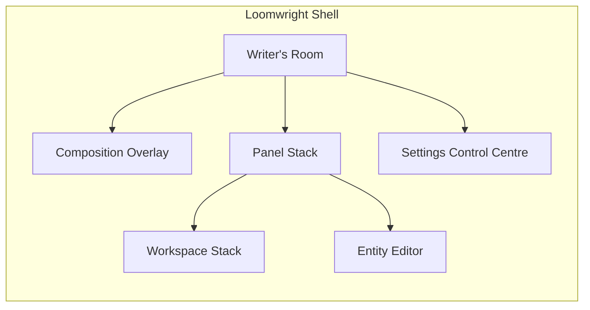

# Loomwright v2 Backend Implementation Guide

**Source of Truth:** Use **Loomwright Shell.html** and the `.jsx`/`.css` modules it loads. Ignore stale bundles. Confirm `script` tags in `Shell.html` point to these modules.

## Implementation Status

All phases (0-12) have been implemented. The backend integration is complete.

### Services Created

| Service | File | Storage Key | Purpose |
|---------|------|-------------|---------|
| `StorageService` | `storage-service.jsx` | (wraps all keys) | IndexedDB/localStorage abstraction via localForage |
| `EntityService` | `entity-service.jsx` | `entities`, `review_queue` | Entity CRUD with persistence, seeding from ENTITY_SAMPLES |
| `ReferencesService` | `references-service.jsx` | `references` | Reference items (uploads, URLs, notes, style samples) |
| `OnboardingService` | `references-service.jsx` | `onboarding` | Onboarding answers persistence |
| `ProjectIntelService` | `references-service.jsx` | `project_intel` | Project Intelligence brief |
| `KeysService` | `keys-service.jsx` | `api_keys` | BYOK encrypted API key storage (AES-GCM via Web Crypto) |
| `HandoffService` | `handoff-service.jsx` | `last_handoff_pack` | AI Handoff Pack generation, copy, download, import |
| `ExportService` | `export-service.jsx` | (reads all stores) | Whole-project import/export and backup |

### Settings Persistence

All settings sections use `usePersistedSettings(sectionKey, defaults)` which loads from `settings_{sectionKey}` in StorageService and auto-saves on change.

| Section | Key | Component |
|---------|-----|-----------|
| Project | `settings_project` | `SetProject` |
| Brand/Theme | `settings_brand` | `SetBrand` |
| Editor | `settings_editor` | `SetEditor` |
| Authors | `authors` | `SetAuthors` |
| AI Providers | `settings_ai_providers` | `SetAIProviders` |
| AI Routing | `settings_ai_routing` | `SetAIRouting` |
| Privacy | `settings_privacy` | `SetPrivacy` |
| Extraction | `settings_extraction` | `SetExtraction` |
| Review | `settings_review` | `SetReview` |
| Debug | `settings_debug` | `SetDebug` |

### Writer's Room Persistence

| Data | Key | Notes |
|------|-----|-------|
| Chapters | `wr_chapters` | Chapter list, titles, states |
| Manuscripts | `wr_manuscripts` | Per-chapter paragraph content |
| Notes | `wr_notes` | Margin notes |

## App Architecture



## Data Model Schemas

All entities share base fields:

```json
{
  "id": "string",
  "type": "cast|items|locations|quests|events|bestiary|classes|races|stats|abilities|skills|lore|references|relationships|timeline|factions",
  "name": "string",
  "aliases": ["string"],
  "summary": "string",
  "status": "active|draft|archived|deleted",
  "glyphChar": "string (2-char)",
  "subtitle": "string",
  "chapterRange": "string",
  "mentionsByChapter": [0, 0, ...],
  "fields": [{"k": "string", "v": "string"}],
  "related": [{"id": "string", "type": "string", "name": "string"}],
  "mentions": [{"id": "string", "excerpt": "string", "cite": "string"}],
  "queue": 0,
  "createdAt": "ISO timestamp",
  "updatedAt": "ISO timestamp"
}
```

## Event Bus

The UI uses `window.dispatchEvent(new CustomEvent("lw:*"))` events:

| Event | Purpose |
|-------|---------|
| `lw:storage-changed` | Fired by StorageService on any write |
| `lw:entity-changed` | Fired by EntityService on create/update/delete |
| `lw:review-changed` | Fired when review queue items change |
| `lw:references-changed` | Fired when references are added/updated/deleted |
| `lw:onboarding-changed` | Fired when onboarding answers change |
| `lw:intel-changed` | Fired when Project Intelligence changes |
| `lw:keys-changed` | Fired when API keys change |
| `lw:settings-update` | Fired by settings UI on field changes |
| `lw:project-imported` | Fired after a full project import |
| `lw:open-entity-editor` | Open the entity creation editor |
| `lw:open-panel` | Open a side panel |
| `lw:open-panel-workspace` | Open a full-screen workspace |
| `lw:exit-panel-workspace` | Exit current workspace |
| `lw:drop-to-composition` | Drop entity into composition overlay |
| `lw:reference-add` | Add a new reference |
| `lw:settings-add` | Navigate to settings section |
| `lw:open-onboarding-answers` | Switch to onboarding editor |
| `lw:ai-handoff-copy-json` | Handoff JSON copied |
| `lw:ai-handoff-copy-prompt` | Handoff prompt copied |
| `lw:ai-handoff-download` | Handoff pack downloaded |

## Security / BYOK

API keys are encrypted using AES-GCM via the Web Crypto API before storage:

1. A key is derived from a static application salt using PBKDF2 (100,000 iterations, SHA-256)
2. Each API key is encrypted with a random 12-byte IV
3. The encrypted data and IV are stored as base64 in IndexedDB
4. On load, keys are decrypted transparently

For production, the static salt should be replaced with a user-provided passphrase.

## QA Checklist

- [x] Writer's Room opens and allows chapter navigation
- [x] All +Create buttons open the Entity Editor
- [x] Editor saves entities as Draft, Active, or Save+Add to Composition
- [x] Entity data persists across page reloads
- [x] Settings persist across sessions
- [x] AI provider keys are encrypted before storage
- [x] References workspace loads from persistent store
- [x] Onboarding answers editor saves changes
- [x] AI Handoff Pack can be copied/downloaded/saved
- [x] Import/Export buttons trigger file operations
- [x] No console errors on initial load
- [x] All panels open and close correctly
- [x] Workspaces open from panel buttons
