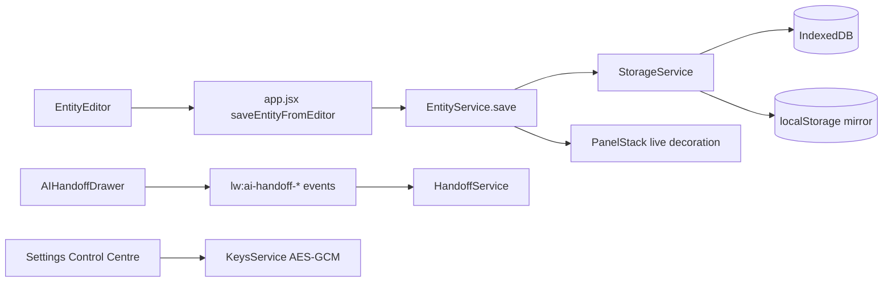

# Coding Agent Handoff

> **2026-05-18 update.** Subsequent wiring pass closed seven runtime gaps
> (merge modal, composition handlers, AI handoff listeners, trash, sample
> gating, panel action props, persisted EntityOccurrence). See
> `IMPLEMENTATION_STATUS.md` for the up-to-date state. Key changes:
> Writer's Room manuscript double-click now resolves entities by real ID
> via `OccurrenceService` first; fuzzy label matching remains as a
> legacy/demo fallback only. Fresh projects start empty — sample data
> only loads when the user clicks "Load sample project" in Settings.

## Source-of-Truth Files

- Entry: `Loomwright Shell.html`
- Redirect: `index.html`
- Root app: `app.jsx`
- Local backend layer: `backend-services.jsx`
- Entity editor: `entity-editor.jsx`, `entity-editor-configs*.jsx`
- Panels: `panel-stack.jsx`, `panels.jsx`, `cast.jsx`, `upgrades-*.jsx`
- Workspaces: `full-workspaces.jsx`, `workspaces-rpg.jsx`, `workspaces-narrative.jsx`, `workspaces-system.jsx`
- Settings: `settings-rich.jsx`
- AI handoff: `ai-handoff.jsx`

Do not edit `Loomwright.bundle.jsx`; the shell does not load it.

## What Was Implemented

- Added `backend-services.jsx`, a static-shell-compatible local backend.
- Added IndexedDB persistence with localStorage mirror under `lw:v2:*`.
- Seeded the persistent entity store from existing demo globals.
- Wired `EntityEditor` saves to `EntityService`.
- Draft saves create review queue placeholder items.
- Save + Add stores the entity and drops it into the Writer's Room composition overlay.
- Persisted the composition overlay.
- Added manuscript save snapshots from Writer's Room save/extract buttons.
- Persisted Settings sections through `SettingsService`.
- Encrypted BYOK API keys through Web Crypto AES-GCM in `KeysService`; the root key is a non-extractable CryptoKey stored in IndexedDB.
- Persisted onboarding answers and enabled Project Intelligence merge.
- Added project/entity/settings export/import delegate handlers.
- Added AI handoff event logging/import handling.

## Core Globals

```js
window.LoomwrightBackend
window.StorageService
window.EntityService
window.ReferencesService
window.OnboardingService
window.ProjectIntelService
window.KeysService
```

## Important Storage Keys

- `entities`
- `references`
- `onboarding_answers`
- `project_intelligence`
- `settings`
- `ai_provider_settings`
- `api_keys_encrypted`
- `review_queue`
- `manuscript`
- `composition_overlay`
- `ai_handoff_log`
- `trash`

## Event Flow



## Data Model Reminder

Entity base:

```js
{
  id, type, name, aliases, summary, description,
  status, flags, tags, sourceMentions,
  reviewQueueCount, createdAt, updatedAt
}
```

Project Intelligence:

```js
{
  projectFoundation,
  writingStyleGuide,
  toneKeywords,
  canonRules,
  characterSummaries,
  extractionRules,
  privacySettings,
  lastUpdated
}
```

## Known Constraints

- AI calls run only when the user explicitly triggers Test Connection, Generate, or Extraction. BYOK keys stay local.
- Key encryption is local AES-GCM using Web Crypto and a browser-local, non-extractable root key in IndexedDB. It protects against casual localStorage inspection but is not a substitute for OS credential storage.
- Writer's Room chapters and paragraph structures persist via `ManuscriptChapterService`. Load sample project from Settings → Import/export for demo content.
- The app is static/global-script based, not a bundler module graph.

## Continue-From-Here Tasks

1. Add deeper UI affordances for editing existing entities from panel detail views.
2. Replace fuzzy manuscript entity focus with fully ID-based links everywhere.
3. Extend `TrashService` into panel/workspace restore/delete buttons.
4. Add automated browser smoke tests if a Playwright/Cypress setup is introduced.
5. If real AI calls are ever added, keep BYOK, explicit user confirmation, and local-only defaults.

## QA Commands

```bash
npm run validate
npm run build
npm run dev
```

Manual smoke:

- Open Writer's Room.
- Open Cast/Locations/Items panels.
- Create an entity as draft and active.
- Save + Add to Composition.
- Open Settings → AI providers; store/clear a key.
- Open References → Onboarding Answers; edit/apply JSON.
- Export project data from Settings → Import/export.
# Loomwright v2 — Coding Agent Handoff

This document is the bridge between the **design build** of Loomwright v2 and the
coding agent that will turn it into a real, persistent application. The visual
shell, panel stack, entity framework, Writer's Room, Composition Overlay,
References / Onboarding Answers / Settings Control Centre, and every workspace
are already wired and presentational — the coding agent's job is to back them
with real state, storage, and AI calls without changing the visual contract.

Read this whole document before you start. Each section ends with a **Coding
Notes** block of concrete asks.

---

## 1. Source of Truth

**Canonical sources** (always start here, edit only these):

- `Loomwright Shell.html` — the only entry HTML the user runs. It pulls every
  module via `<script src="…">` at the bottom of `<body>`. It also has the
  Writer's Room inlined as a `<script type="text/babel">` block at the end
  (legacy artefact; see Section 4 for the contract).
- All `*.jsx` modules in the project root, each a single concern:
  - `app.jsx` — the React root + `<AppShell>` + routing.
  - `brand.jsx` — `BRAND`, `ENTITY_TYPES`, `CONFIDENCE`, `NAV_ITEMS`.
  - `shell-parts.jsx`, `panel-stack.jsx`, `panel-access.jsx`,
    `entity-framework*.jsx`, `entity-editor*.jsx`, `composition-overlay.jsx`,
    `workspaces-*.jsx`, `settings-rich.jsx`, etc.

**Do NOT treat these as canonical:**

- `Loomwright.bundle.jsx` — a flattened build artefact. **Stale.** Regenerate
  from the JSX modules if you need a bundle, never edit it by hand.
- `Loomwright Shell - Standalone.html` and `Loomwright Shell.standalone-src.html`
  — exports for offline review. Stale by the same rule.
- `Loomwright Shell-print.html` — print export. Stale.

Anything in `*_HOOKUP.md` is design-time intent, not code. Treat those files as
specifications for what each surface expects from the backend — they're useful
context, not implementations.

### Active entry files (read order)

1. `Loomwright Shell.html` — head loads CSS; body loads scripts in dependency
   order; ends with `app.jsx`. The Writer's Room is the last inline block before
   `app.jsx`.
2. `app.jsx` — sets up `<AppShell>` which owns route, panels, overlay, editor,
   panel-workspace state.
3. `brand.jsx` — defines `NAV_ITEMS` (the left rail), `ENTITY_TYPES` (the
   colour and label authority for every entity surface), and the `BRAND`
   constant (project name, author, accent).
4. `workspace.jsx` — the placeholder Workspace shown for legacy entity routes.
   New work should land in `workspaces-*.jsx`, not here.

---

## 2. App Architecture

### Layout

```
+----------------------------------------------------------+
| Top bar  (brand · project · privacy · sync · gear · me)  |
+--------+----------------------------------+--------------+
| Left   | Main route content                              |
| rail   | (Home | Today | Writer's Room | Workspace)      |
|        |                                                  |
|        |   + PanelStack overlays from the right          |
|        |   + FullWorkspaceHost overlays the whole canvas |
+--------+----------------------------------+--------------+
| Bottom status strip (mode · saves · queue · zoom)        |
+----------------------------------------------------------+
```

### Three structural surfaces

1. **Routes** — top-level views the left rail navigates to.
   Only **four** valid `routeId` values:
   - `home` → `<HomeScreen>`
   - `today` → `<TodayScreen>`
   - `writers-room` → `<WritersRoomScreen>` (the project's anchor)
   - `settings` → **NEVER ROUTES TO THE PLACEHOLDER.** Settings opens the
     `control-centre` panel workspace as a full-screen overlay. See Section 3.

2. **Panel stack** — every entity tab (Cast, Atlas, Items, Quests, Events,
   Skill Trees, Relationships, Timeline, Lore, References, Bestiary, Locations,
   Classes, Races, Stats, Abilities) opens as a docked side panel from the
   right. Panels stack and can be pinned, expanded, collapsed, reordered, or
   closed. Owned by `<PanelStack>` in `panel-stack.jsx`. The state lives in
   `app.jsx` as `panels`.

3. **Panel workspaces** — full-screen overlays each panel can "promote" into.
   These are bigger, multi-column working surfaces (Research Library, Control
   Centre, Trash Manager, Speed Reader, Atlas Editor, Skill Tree Editor,
   Relationships, Timeline, Tangle, etc.). Owned by `<FullWorkspaceHost>` in
   `full-workspaces.jsx`, dispatching by `workspace.id` into
   `window.WORKSPACE_COMPONENTS`.

### State ownership map

| State                       | Owner            | File                       |
|----------------------------|------------------|---------------------------|
| route (4 valid ids)        | `<AppShell>`     | `app.jsx`                 |
| `panels[]` (the stack)     | `<AppShell>`     | `app.jsx`                 |
| `focusedByType` map        | `<AppShell>`     | `app.jsx`                 |
| `editor` (entity editor)   | `<AppShell>`     | `app.jsx`                 |
| `overlay` (composition)    | `<AppShell>`     | `app.jsx`                 |
| `panelWorkspace` (full ws) | `<AppShell>`     | `app.jsx`                 |
| Writer's Room layout       | `useLayoutState` | `layout-state.jsx`        |
| Chapter list & manuscript  | Local to WR      | inlined in HTML           |
| Onboarding answers         | Local (demo)     | `workspaces-system.jsx`   |
| References (demo data)     | `window.REFERENCES` | `lore-references.jsx`  |
| Entity demo data           | `window.*_SAMPLE`/`MOCK_*` | per-module       |

### Event bus

Cross-component coordination uses `window.addEventListener` + `CustomEvent`.
All events use the `lw:` prefix and are listed in **Section 5** under their
originator.

---

## 3. Route Rules

### The four routes

- `home`, `today`, `writers-room` are full-screen content views.
- `settings` is a **system route** that does **not** render `<Workspace>`. The
  left-rail click handler in `app.jsx` intercepts `item.id === "settings"` and
  calls `onOpenSettings()` which opens the `control-centre` panel workspace.
  The previous `routeId` is preserved untouched — the workspace's Exit button
  closes the overlay and returns the user to their previous main route
  (usually Writer's Room).

### Settings — full behaviour contract

```js
// app.jsx
const onOpenSettings = useCallback(() => {
  openPanelWorkspace({
    workspaceId: "control-centre",
    panelKind:   "settings",
    sourcePanel: "p-settings",
  });
}, [openPanelWorkspace]);

// Left rail
onActivateItem={(item, ctx) => {
  if (item.kind === "route") {
    if (item.id === "settings") {
      onOpenSettings();      // <-- never setRouteId("settings")
      return;
    }
    setRouteId(item.id);
    return;
  }
  activatePanelFromRail(item.panelKind || item.entity || item.id, ctx);
}}
```

**Hard rules:**

- Settings never appears as the value of `routeId`.
- Settings never renders inside `<Workspace>`.
- Topbar gear (`onOpenSettings` in `shell-parts.jsx`) and left-rail Settings
  both open the same `<ControlCentreWorkspace>`.
- Closing the workspace (X / Esc / Exit) restores the prior route exactly —
  Writer's Room panels and selection state are untouched because we never
  unmounted anything.
- Deep-linking into a specific Settings section is done by dispatching
  `window.dispatchEvent(new CustomEvent("lw:settings-section", { detail: { actionId: "intel" }}))`
  **after** opening the workspace. `ControlCentreWorkspace` listens for this.

### Panel workspaces

Some panel kinds open their own in-body full-screen instead of a workspace
overlay (`panel-access.jsx` → `workspaceMode: "existing"` for atlas, skills,
abilities). For everything else, `app.jsx → openPanelWorkspace` reads
`PANEL_ACCESS[panelKind]` and dispatches into `FullWorkspaceHost`.

---

## 4. Key Files Map

| File                                | Purpose                                                                 |
|------------------------------------|-------------------------------------------------------------------------|
| `Loomwright Shell.html`            | Entry HTML. Loads all CSS + JSX modules. Writer's Room inlined.         |
| `app.jsx`                          | `<AppShell>` — route, panels, overlay, editor, panel-workspace state.   |
| `brand.jsx`                        | `BRAND`, `ENTITY_TYPES`, `CONFIDENCE`, `NAV_ITEMS`.                     |
| `icons.jsx`                        | `<Icon>` component (SVG library).                                       |
| `primitives.jsx`                   | `<Btn>`, `<EntityTypeBadge>`, `<ConfidenceBadge>`, empty/loading/error. |
| `shell-parts.jsx`                  | `<TopBar>`, `<LeftRail>`, `<BottomStatusStrip>`, `<CommandPalette>`.    |
| `panel-stack.jsx`                  | `<PanelStack>` + `<DockedPanel>`. Pinning, ordering, collapsing.        |
| `panel-access.jsx`                 | Per-panel `+ Create` and `Open Workspace` overlay buttons.              |
| `panels.jsx`                       | Panel body templates: overview, selected, multi, empty, loading, error. |
| `entity-data.jsx`                  | Sample data for the entity framework.                                   |
| `entity-framework*.jsx`            | `EntityFrameworkPanelBody` (generic) + host + shell.                    |
| `entity-editor.jsx` / configs      | Right-docked 75%-width entity creation/edit editor.                     |
| `entity-editor-configs(-extended).jsx` | Per-entity-type field schemas the editor consumes.                  |
| `composition-overlay.jsx`          | Writer's Room AI composition overlay (drag-into composition).           |
| `ai-handoff.jsx`                   | `<AIHandoffButton>` + handoff pack export modal.                        |
| `entity-drag.jsx`                  | Drag-source plumbing for entities (drop into composition).              |
| `cast.jsx`                         | Bespoke Cast panel (renderer for `entityType === "cast"`).              |
| `atlas-*.jsx`                      | Atlas data, map, side, focus, quick, editor; full Atlas suite.          |
| `skill-trees.jsx`                  | Skills + Abilities merged tree.                                         |
| `relationships.jsx`                | Relationship graph panel.                                               |
| `timeline.jsx`                     | Timeline scroller.                                                      |
| `lore-references.jsx`              | Lore/Canon panel + References panel (the **side panel**, not workspace).|
| `upgrades-*.jsx`                   | Upgraded list panels for Locations, Items, Classes/Races, Stats, Quests/Events, Bestiary/Factions. |
| `tangle.jsx`                       | Tangle canvas placeholder.                                              |
| `today-ai.jsx`, `home.jsx`         | Today + Home routes.                                                    |
| `trash.jsx`                        | Trash panel + Trash workspace data.                                     |
| `workspace.jsx`                    | Legacy placeholder workspace (only used for routes that haven't been promoted). |
| `full-workspaces.jsx`              | `<WorkspaceShell>` + `<FullWorkspaceHost>` dispatcher.                  |
| `workspaces-rpg.jsx`               | RPG full workspaces (Stats sheet, Bestiary atlas, etc.).                |
| `workspaces-narrative.jsx`         | Narrative full workspaces (Quest log, Lore canon, Timeline scrollytell). |
| `workspaces-system.jsx`            | Research Library, Control Centre, Trash, Speed Reader, Relationship, Tangle workspaces. |
| `settings-rich.jsx`                | Deep `<RichSettingsSection>` renderers used by Control Centre.          |
| `speed-reader.jsx`                 | Speed Reader.                                                           |
| `extraction-*.jsx`, `review-*.jsx` | Extraction progress modal, session drawer, review queue, merge/edit/deny modals. |
| `overlays.jsx`                     | `<AdaptiveWheelHost>`.                                                  |
| `onboarding*.jsx`                  | Step manifest + presets + the wizard itself.                            |
| `tweaks-panel.jsx`                 | Floating Tweaks panel (debug + theme).                                  |
| `layout-state.jsx` / `layout-controls.jsx` | Writer's Room layout mode (full/clean/notes/review/manuscript-focus). |
| `tokens.css`, `components.css`     | Base CSS (parchment-light, type, density).                              |

---

## 5. Visual Systems — What Is Mock vs Real

> Mock = visual only, **the coding agent must implement the data + behaviour**.
> Wired = the visual is hooked up to the in-shell state already and just needs
> a real backend store under it.

### Writer's Room — **Wired UI, Mock Data**

- File: inlined at the end of `Loomwright Shell.html`, under `<WritersRoomScreen>`.
- Demo data: `WR_AUTHORS`, `WR_CHAPTERS`, `WR_MANUSCRIPT`, `WR_NOTES`,
  `WR_EXTRACTIONS` (constants in the same script block).
- Layout, focus mode, margins, save modes, extraction modal flow, save state,
  selection chip, hover snapshot, scene breaks — **all visually complete**.
- Entity mention highlights use `<EntityBrushHighlight>` with `data-entity`
  and `data-entity-id` attributes — both surfaced for the coding agent's text
  selection / range mapper.

**Entity mention — interaction contract (now wired):**

```jsx
<EntityBrushHighlight
  type="cast" id="e-aelinor"
  onClick={…snapshot}           // single click = snapshot
  onDoubleClick={(e) => {       // double click = open & focus
    e.preventDefault();
    onEntityDoubleClick({ type, id, text, label });
  }}
  onMouseEnter={…popover}
  onMouseLeave={…dismiss}
>Aelinor Vey</EntityBrushHighlight>
```

The bubble-up path is:
`EntityBrushHighlight → ManuscriptParagraph → ManuscriptCanvas → WritersRoomScreen → onOpenEntityFromManuscript (prop) → app.jsx`.

`app.jsx` translates `type` → panelKind via `ENTITY_TYPE_TO_PANEL_KIND`, calls
`onOpenPanel(panelKind)` (which de-duplicates), and sets `focusedByType` so the
panel highlights the right entity.

##### Design-only fuzzy match (replace at integration)

`app.jsx → onOpenEntityFromManuscript` currently does an extra step for the
demo: after opening the panel it walks `panel.rows` and marks the
best-label-match as `selected` (exact → substring either way → first
significant word). This is **purely cosmetic** — it exists so the demo
visibly highlights "Captain Brec" in the Cast panel when the manuscript span
is double-clicked, despite the mock rows using ids like `c3` instead of
`e-brec`.

When the real entity store lands, drop the fuzzy block and select by id —
`detail.id` (e.g. `e-brec`) and the entity row's id should match by
construction. The fuzzy block is bracketed clearly in the source for easy
removal.

#### Coding Notes — Writer's Room

- Replace `WR_MANUSCRIPT` with a real document model (paragraph nodes, inline
  marks). Each mark needs `{type, id, range}`.
- Implement `onManuscriptChange` → debounced autosave + entity-span
  reconciliation.
- Implement `onSaveAndExtract`, `onSaveAndDeepExtract` → call the extraction
  pipeline; surface stages in `<ExtractionProgressModal>` (already wired).
- Implement chapter CRUD: `onCreateChapter`, `onReserveChapter`,
  `onReorderChapter`, `onConfirmDeleteChapter`.
- Implement `onEntityDoubleClick` → already wired into `onOpenPanel` +
  `focusedByType`. You only need to make the panel's filter implementation
  honour `focusedByType[entityType]` for highlighting.

---

### Entity Extraction & Review — **Mock**

- Modal flow: `<ExtractionProgressModal>` → `<ExtractionSessionDrawer>` →
  per-card actions in the right margin (Accept / Edit / Merge / Deny / Open
  full review).
- All actions optimistically remove the candidate from
  `WR_EXTRACTIONS` and pop a modal where relevant.
- Confidence levels (`high`, `strong`, `uncertain`, `weak`) live in
  `brand.jsx → CONFIDENCE` and drive the colour ramp on margin cards.

#### Coding Notes — Extraction

- Wire the actual extraction service (local LLM or cloud) to populate
  `extractions` for the active chapter.
- Persist `reviewQueueItem` objects: `{id, chapterId, type, name, conf, pct, quote, anchor, suggestion}`.
- On Accept: create/update entity, remove from queue, broadcast a panel-open
  event if the panel isn't already showing.

---

### Entity Creation Editor — **Wired UI, Stubbed Save**

- File: `entity-editor.jsx` + `entity-editor-configs.jsx` +
  `entity-editor-configs-extended.jsx`.
- Right-docked at 75% width over any route. Triggered by:
  - left-rail `+ Create` button on a panel (`panel-access.jsx`)
  - `lw:open-entity-editor` event from anywhere
  - manuscript "Create entity from selection"
  - "Promote from extraction"
- Modes: `full`, `quick`, `json`, `promote`. Each per-type config defines its
  fields, JSON shape, and demo data.

#### Coding Notes — Entity Editor

- `onSave(payload, opts)` (in `app.jsx`) currently routes the composition-mode
  draft into the overlay. Add: persist the entity, broadcast `lw:entity-saved`
  so panels can refresh.
- Implement `mode: "json"` validation against the per-type schema.
- Wire `promoteFrom` so an accepted review-queue item pre-fills the editor.

---

### Composition Overlay (Writer's Room AI) — **Wired UI, No AI**

- File: `composition-overlay.jsx`. Triggered by `lw:drop-to-composition` event,
  by drag-drop from any panel (`entity-drag.jsx`), or by the WR toolbar.
- Stores `entities[]`, `instructions`, `settings`, `contextOptions` in
  `app.jsx → overlay` state.
- Actions present: Generate Draft, Insert Draft, Create Chapter, Copy Prompt,
  Save Preset, Clear All — all stubs.

#### Coding Notes — Composition Overlay

- Wire `onGenerateDraft` → AI provider (use the active provider configured in
  Settings → AI Providers; this is BYOK).
- Wire `onInsertDraft` → splice into the active chapter at the cursor.
- Wire `onCreateChapter` → create chapter populated with the draft.
- `onCopyPrompt` should produce a copy-pasteable prompt (handoff pack format,
  see `ai-handoff.jsx`).

---

### AI Handoff Pack — **Wired UI**

- File: `ai-handoff.jsx`. Surfaces in: Composition Overlay, References,
  Settings → Project Intelligence, individual entity surfaces.
- Modal shows: included entities, included references, instructions, and a
  Copy/Download JSON action.

#### Coding Notes — AI Handoff

- The export shape is `{instructions, projectContext, entities, references}`.
- Implement actual download + clipboard copy.
- Implement **import** path: paste a JSON pack and merge changes back —
  diff preview + apply.

---

### References (Research Library) — **Wired UI, Mock Data**

The References surface has **two faces** — a **side panel** (`lore-references.jsx
→ ReferencesPanelBody`) and a **full workspace** (`workspaces-system.jsx →
ResearchLibraryWorkspace`). They share data via `window.REFERENCES`.

**Research Library workspace** (the canonical big surface):

- 3-column layout: left = Library nav + filters + cross-links; centre = drop
  zone + tiles; right = inspector or JSON editor.
- Has two modes: `library` (default) and `onboarding` (the editor).
- Cross-links: **Onboarding Answers** (in-workspace), **Project Intelligence**
  (opens Control Centre → intel), **Settings** (opens Control Centre).
- Filters: All / Uploads / URLs / Style / Canon / Research / Onboarding.

#### Coding Notes — References

- Replace `REFERENCES` array with a persistent store. Schema in Section 6.
- Implement `onUploadReference`, `onPasteReference`, `onAddReferenceUrl`,
  `onAddWritingStyleSample`, `onAddCanonSource`, `onAddResearchNote`.
- Implement `onToggleReferenceAIContext`, `onToggleReferenceStyleInfluence`,
  `onToggleReferenceCanonSource`.
- Implement `onLinkReferenceToEntity` (right inspector, "+ Link entity").
- Implement `onSendReferenceToProjectIntelligence` (currently surface-only).
- Implement `onExportReferenceContextPack` (use `ai-handoff.jsx` export).

---

### Onboarding Answers — **Editor UI complete, Storage TODO**

Lives inside `ResearchLibraryWorkspace` (`view === "onboarding"`).

- Section nav (Project / Style / World / Cast / Plot / Refs / AI / Privacy).
- Each section: inline editable fields rendered from the section's data object
  via `<OnboardingField>`. Booleans render as a checkbox, long strings as
  textarea, short strings as input.
- Right panel: `<OnboardingJsonPanel>` — Copy JSON, Paste from clipboard,
  Validate, Preview, Apply.
- Top bar: "Back to library", "Reopen wizard".
- Sticky footer of each section: "Reopen full wizard", "Send to Project
  Intelligence", optional "Mark as style reference" / "Mark as canon source".

**Demo shape lives in** `ONBOARDING_ANSWERS_FALLBACK` (`workspaces-system.jsx`).
At runtime, the workspace reads `window.ONBOARDING_ANSWERS` if present.

**Events:**

- `lw:open-onboarding-answers` (no detail OR `{stepId}`) → opens the editor at
  the named section. Listened to by `ResearchLibraryWorkspace`.
- `lw:open-onboarding-wizard` (`{stepId?}`) → coding agent should re-open the
  full wizard from this step.

#### Coding Notes — Onboarding Answers

- Persist `ONBOARDING_ANSWERS` to disk/localStorage/server. Schema in Section 6.
- Diff preview for `onPreviewOnboardingImport` is currently surfaced as a
  toast — render an actual diff (per-section, per-field).
- `onSendOnboardingToProjectIntelligence` must call into the Project
  Intelligence rebuild pipeline (see Section 5 → Project Intelligence).
- `onMarkOnboardingAsStyleReference` / `onMarkOnboardingAsCanonSource` should
  create reference rows backed by the onboarding answer.

---

### Project Intelligence — **Surfaced everywhere, No engine**

- Settings → Project Intelligence section (`settings-rich.jsx → SetIntel`)
  surfaces: Open File, Open References, Open Onboarding Answers, External-AI
  handoff actions.
- Referenced from: References (cross-link), Onboarding Answers (cross-link),
  Settings (own section), AI Handoff Pack.

#### Coding Notes — Project Intelligence

- Implement `projectIntelligence` model (Section 6).
- Implement `onRebuildProjectIntelligenceFromSources`: read References +
  Onboarding Answers + entity summaries → produce a structured brief.
- `onCopyProjectIntelligenceJson`, `onImportProjectIntelligenceJson`,
  `onValidateProjectIntelligenceJson`, `onPreviewProjectIntelligenceDiff`,
  `onApplyProjectIntelligenceImport` — wire to a real intel store.

---

### Settings Control Centre — **Wired UI, Stubbed Persistence**

- File: `workspaces-system.jsx → ControlCentreWorkspace` + section bodies in
  `settings-rich.jsx`.
- 13 sections: Project, Project Intelligence, Brand/Theme, Author Profiles,
  AI Providers, AI Routing/Cost, Privacy, Editor, Extraction, Review Queue,
  References/Research, Import/Export, Keyboard Shortcuts, Debug.
- Deep-link via `lw:settings-section` event → `actionId` maps to section id.

**AI Providers** (BYOK by default):

- Curated providers: OpenAI, Anthropic/Claude, Google Gemini, OpenRouter,
  Local/Ollama, Custom OpenAI-compatible.
- Add Provider menu: Mistral, Cohere, Together AI, Groq, Perplexity,
  ElevenLabs, Stability, Other.
- Each provider card has enabled toggle, API key field, model preference,
  "Where to get this key" link, Test Connection, use-case toggles,
  privacy note.

#### Coding Notes — Settings

- Implement secure storage for API keys (OS keychain / encrypted local store).
- `onTestAIProviderConnection` should actually ping the provider.
- `onUpdateAIRoutingSettings` should affect routing in the Composition Overlay
  and Extraction service.
- `onResetLayout` + `onClearLocalDemoData` should be destructive but safe.
- `onExportSettingsProfile` / `onImportSettingsProfile` — JSON round-trip.

---

### Entity Panels — Wired UI, Mock Data

Each of these renders via `<PanelStack>` → `<DockedPanel>` →
per-entityType body component:

| panelKind        | Body component               | File                        |
|------------------|-----------------------------|-----------------------------|
| `cast`           | `CastPanelBody`              | `cast.jsx`                  |
| `atlas`          | `AtlasPanelBody`             | `atlas.jsx`                 |
| `bestiary`       | `BestiaryPanelBody`          | `upgrades-bestiary-factions.jsx` |
| `locations`      | `LocationsPanelBody`         | `upgrades-locations.jsx`    |
| `items`          | `ItemsPanelBody`             | `upgrades-items.jsx`        |
| `classes`        | `ClassesPanelBody`           | `upgrades-classes-races.jsx`|
| `races`          | `RacesPanelBody`             | `upgrades-classes-races.jsx`|
| `stats`          | `StatsPanelBody`             | `upgrades-stats.jsx`        |
| `abilities`      | `AbilitiesPanelBody`         | `skill-trees.jsx`           |
| `skillTrees`     | `SkillsPanelBody`            | `skill-trees.jsx`           |
| `relationships`  | `RelationshipsPanelBody`     | `relationships.jsx`         |
| `quests`         | `QuestsPanelBody`            | `upgrades-quests-events.jsx`|
| `events`         | `EventsPanelBody`            | `upgrades-quests-events.jsx`|
| `timeline`       | `TimelinePanelBody`          | `timeline.jsx`              |
| `lore`           | `LorePanelBody`              | `lore-references.jsx`       |
| `references`     | `ReferencesPanelBody`        | `lore-references.jsx`       |
| `factions`       | (none — routes to Lore)      | n/a                         |

All bodies accept `panel` and `onSelectEntity`. Selecting a row calls
`onSelectEntity({id, label, entityType})` which broadcasts into
`focusedByType` so OTHER panels can filter by it (cross-panel context).

#### Coding Notes — Entity Panels

- Each panel reads demo data from `window.*_SAMPLE` constants. Replace with
  real data stores.
- Honour `focusedByType[entityType]` from props as an in-panel filter/highlight
  (the panel-stack already passes it).
- Panels accept `selected` to default-focus a row on open.

---

### Cast / Atlas / Skill Trees / Relationships / Timeline / Lore — Wired UI, Mock Data

These are deeper than the generic framework. Each has its own bespoke
detail view, multi-select, edit flow. Same mock-data model: replace
`*_SAMPLE` constants with stores.

### Atlas Editor / Skill Tree Editor — Wired UI, Mock Data

These open as **in-body full-screen** (not as workspace overlay) via
`window.dispatchEvent(new CustomEvent("lw:open-existing-fullscreen", {detail}))`.
The panel body listens for the event and toggles its own full-screen mode.
**Do not break this contract** — see `panel-access.jsx` →
`workspaceMode: "existing"`.

### Speed Reader — Wired UI, Mock Manuscript

`workspaces-system.jsx → SpeedReaderWorkspace`. Iterates `WR_MANUSCRIPT`-shaped
text. Wire to real manuscript model.

### Trash — Wired UI, No Restore Engine

`trash.jsx` (panel) + workspace (`workspaces-system.jsx`). Items show 30-day
retention. Implement `onRestoreItem`, `onPurgeItem`, `onEmptyTrash`.

---

## 6. Data Model Intention

The intent is everything entity-shaped flows through a single `entityBase`
record, with extra fields per type stored under `data`.

### `entityBase`

```ts
type EntityBase = {
  id: string;                  // stable, e.g. "e-aelinor"
  type: "cast" | "locations" | "items" | "atlas" | "quests" | "events"
      | "bestiary" | "lore" | "references" | "classes" | "races" | "stats"
      | "skillTrees" | "abilities" | "relationships" | "timeline";
  name: string;
  aliases: string[];
  summary?: string;            // 1-2 sentence dossier intro
  description?: string;        // long-form
  status?: string;             // "alive" | "dead" | "missing" | "unknown" | etc.
  flags: { [k: string]: boolean }; // e.g. {canon: true, draft: false}
  tags: string[];
  linkedEntities: Array<{ id: string; type: EntityBase["type"]; role?: string }>;
  sourceMentions: SourceMention[];
  reviewQueueCount: number;
  createdAt: string;           // ISO
  updatedAt: string;           // ISO
  data?: any;                  // per-type fields (typed elsewhere)
};
```

### `sourceMention`

```ts
type SourceMention = {
  id: string;
  chapterId: string;
  paragraphId: string;
  // [start, end) offsets into the paragraph's plain-text content.
  range: [number, number];
  text: string;                // the literal mention as it appears
  confidence?: "high" | "strong" | "uncertain" | "weak";
};
```

### `reviewQueueItem`

```ts
type ReviewQueueItem = {
  id: string;
  chapterId: string;
  entityType: EntityBase["type"];
  candidateName: string;
  candidateAliases?: string[];
  confidence: "high" | "strong" | "uncertain" | "weak";
  confidencePct: number;       // 0..100
  quote: string;
  anchor: string;              // paragraph id
  suggestion: {
    action: "create" | "update" | "merge";
    mergeIntoId?: string;
    updates?: Partial<EntityBase>;
  };
  createdAt: string;
};
```

### `compositionPayload`

```ts
type CompositionPayload = {
  entities: Array<{
    id: string;
    entityType: EntityBase["type"];
    name: string;
    summary?: string;
    role: "lead" | "supporting" | "referenced" | "background";
  }>;
  instructions: string;
  settings: {
    mode: "new-scene" | "continuation" | "rewrite" | "expand";
    pov: string;
    length: string;             // free-text or enum, see composition-overlay.jsx
    tone: string;
    chapterTarget?: string;
  };
  contextOptions: {
    currentChapter: boolean;
    projectIntel: boolean;
    obeyCanon: boolean;
    preserveVoices: boolean;
    avoidContradictions: boolean;
  };
};
```

### `crossPanelContext`

```ts
type CrossPanelContext = {
  // The shared state behind focusedByType.
  // Each entry: when an entity is selected in panel X, panel Y can filter to
  // mentions/relationships involving it.
  [entityType: string]: {
    id: string;
    label: string;
    ts: number;
  };
};
```

### `projectIntelligence`

```ts
type ProjectIntelligence = {
  version: number;
  title: string;
  genre: string;
  subgenre?: string;
  voice: string;
  pov?: string;
  tense?: string;
  taboos: string[];
  styleRules: string[];
  canonRules: Array<{ id: string; statement: string; sourceRefs: string[] }>;
  currentArc: string;
  entitiesSummary: {
    [entityType: string]: Array<{ id: string; name: string; summary: string }>;
  };
  sources: {
    onboarding: OnboardingAnswers;
    references: string[];          // reference ids included
  };
  updatedAt: string;
};
```

### `referenceSource`

```ts
type ReferenceSource = {
  id: string;
  kind: "upload" | "url" | "paste" | "style" | "canon" | "research" | "onboarding" | "ai-handoff";
  title: string;
  sub?: string;
  body?: string;                 // pasted text / extracted text
  url?: string;
  fileRef?: { name: string; size: number; mime: string };
  aiContext: boolean;            // include in AI prompts by default?
  style: boolean;                // counts as style influence
  canon: boolean;                // counts as canon source
  linkedEntities: string[];      // entity ids
  tags: string[];
  createdAt: string;
  updatedAt: string;
};
```

### `onboardingAnswers`

```ts
type OnboardingAnswers = {
  project: {
    title: string;
    format: "novel" | "novella" | "short-story" | "series" | "rpg-campaign" | string;
    series?: string;
    stage: "drafting" | "revising" | "outlining" | string;
    targetLength: string;
    audience: string;
    goals: string;
  };
  style: {
    genre: string; subgenre?: string; tone: string;
    pov: string; tense: string;
    influences: string; sampleNote?: string;
  };
  world: {
    setting: string; magicSystem?: string; technology?: string;
    factions?: string; canonRules?: string;
  };
  cast: {
    protagonist: string; antagonist?: string;
    supporting?: string; relationshipNote?: string;
  };
  plot: {
    premise: string; structure?: string;
    arcsOpen?: string; endpoint?: string;
  };
  refs: { uploaded?: string; influences?: string; sources?: string };
  ai:   { voice: string; taboos: string; instructions: string; autonomy: string };
  privacy: {
    cloudOptIn: boolean; aiBYOK: boolean;
    sendManuscriptToCloud: boolean; handoffPackAllowed: boolean;
    notes?: string;
  };
};
```

The exact field shape is captured in `ONBOARDING_ANSWERS_FALLBACK`
(`workspaces-system.jsx`) — match it.

---

## 7. Event Bus — Full Reference

All cross-component messages use `window.addEventListener` + `CustomEvent`.

| Event                         | Dispatched by                     | Listened by                  | Detail                                                                |
|------------------------------|----------------------------------|------------------------------|-----------------------------------------------------------------------|
| `lw:open-entity-editor`      | any panel, manuscript            | `app.jsx`                    | `{type, mode, initial?, promoteFrom?}`                                |
| `lw:open-panel`              | any                              | `app.jsx`                    | `{kind}`                                                              |
| `lw:open-panel-workspace`    | any                              | `app.jsx`                    | `{workspaceId, panelKind, sourcePanel, entityId?}`                    |
| `lw:exit-panel-workspace`    | any                              | `app.jsx`                    | `{}`                                                                  |
| `lw:open-existing-fullscreen`| `app.jsx`                        | a panel's body               | `{panelKind, workspaceId, sourcePanel}`                               |
| `lw:drop-to-composition`     | drag handlers, panel actions     | `app.jsx`                    | `{id, entityType, name, summary?}`                                    |
| `lw:reference-add`           | References panel + workspace nav | `app.jsx`                    | `{actionId, sourcePanel}`                                             |
| `lw:settings-add`            | Settings panel "+ menu"          | `app.jsx`                    | `{actionId}`                                                          |
| `lw:settings-section`        | any                              | `ControlCentreWorkspace`     | `{actionId}` (target section id)                                      |
| `lw:open-onboarding-answers` | Settings → Intel; rail; refs     | `ResearchLibraryWorkspace`   | `{stepId?}`                                                           |
| `lw:open-onboarding-wizard`  | Onboarding editor                | host (TODO: wire wizard)     | `{stepId?}`                                                           |

When you add new events, prefix with `lw:` and document them here.

---

## 8. Backend / Real Implementation Priorities

Order matters — earlier items unblock later ones.

1. **Consolidate state.** Today every component reads `window.*_SAMPLE`
   constants or has its own local mock array. Stand up a single project store
   (e.g. Zustand / Redux / file-backed) and replace the demo arrays one panel
   at a time.
2. **Normalise the entity data model.** Use `entityBase` (Section 6) as the
   shape of every entity row. Per-type fields go under `data`.
3. **Persist project data locally.** SQLite or JSON-per-entity in a per-project
   directory. Project = one folder, manuscript + entities + references +
   onboarding + project intelligence + settings.
4. **Implement create/edit/save for entities.** Wire the entity editor's
   `onSave` (`app.jsx`) end-to-end. Make `lw:entity-saved` fire so panels
   refresh.
5. **Implement review queue state.** A persistent queue per project; Accept /
   Edit / Merge / Deny mutate the queue + the relevant entity.
6. **Implement Writer's Room chapter storage.** Each chapter = a paragraph
   array + author attribution + last-saved + word count. Reserved chapters are
   first-class.
7. **Implement manuscript entity span mapping.** Inline marks survive paragraph
   edits. Reconcile on save.
8. **Implement double-click entity open + focus.** UI is wired; you only need
   the panel filter implementations to honour `focusedByType`.
9. **Implement References storage.** Schema in Section 6.
10. **Implement onboarding answer storage + editing.** Persist
    `window.ONBOARDING_ANSWERS`. Diff/preview/apply for JSON imports.
11. **Implement Project Intelligence generation + update.** Rebuild pipeline.
    Diff preview.
12. **Implement AI provider settings (BYOK) securely.** OS keychain.
13. **Implement AI Handoff export/import.** Round-trip JSON.
14. **Implement extraction pipeline.** Local LLM by default.
15. **Implement import/export/backup.** Full project round-trip + settings
    profile + entity library.

---

## 9. Mock-Only / Design-Only Areas

These currently look real but have no behaviour:

- **All AI calls.** Composition Overlay, AI Handoff, extraction modal — every
  AI button is a no-op.
- **Provider Test Connection.** Surface only.
- **Extraction.** The flow is wired (progress modal, session drawer, queue
  cards) but the underlying extraction itself is mocked from the
  `WR_EXTRACTIONS` constant.
- **Entity save/edit.** Editor opens, fields edit, save closes — no persistence.
- **JSON validation/import (entity editor, onboarding, project intelligence).**
  Validates that the JSON parses; does not check schema.
- **AI Handoff import/export.** UI shows the pack; no actual file roundtrip.
- **Project persistence.** No project file is written; reload = back to demo
  state.
- **Trash restore/purge.** UI present; no restore action.
- **Speed Reader markings.** Visual marks; no flagging engine behind them.

---

## 10. Do-Not-Break Design Decisions

These are deliberate. Don't undo them when you implement.

- **Parchment-light identity.** Two themes only (parchment-light, midnight-ink).
  Accent ramp generated from a single accent colour. Type set is one of
  literary/archive/workhorse.
- **Writer's Room is the anchor.** Never auto-route the user away from it.
  Panels open over it; workspaces overlay it but never replace its mount.
- **Panel stack behaviour:**
  - One panel per `panelKind` — never duplicate. (Enforced in
    `app.jsx → onOpenPanel / activatePanelFromRail`.)
  - Left-rail click on an open panel = bring to front + uncollapse, **never**
    close. Close only via the panel's own X or the adaptive wheel.
  - Cmd-click toggles pinned state.
- **Entity colours.** Defined once in `brand.jsx → ENTITY_TYPES`. Used for every
  badge, mention highlight, dossier border, etc. Do not invent new entity
  colours.
- **Confidence colours only in review surfaces.** Don't bleed `CONFIDENCE`
  ramp into dossiers / read views.
- **BYOK by default.** The app does not embed API keys. Provider settings live
  per-author in Settings → AI Providers.
- **References = source library.** It stores raw material.
- **Project Intelligence = distilled brain.** Generated from References +
  Onboarding + entity summaries.
- **Settings = controls.** No raw content lives in Settings. Settings can
  *link* to References and Project Intelligence but never contains them.
- **Abilities merged into Skill Trees.** There's still an `abilities`
  panelKind for legacy callsites, but the body routes into the Skill Trees
  surface. Keep the routing.
- **Settings is never `routeId`.** See Section 3.
- **Writer's Room entity mentions: hover = snapshot, click = snapshot,
  double-click = open & focus.** Do not change this interaction.

---

## 11. Known Final Issues / TODOs

Carried into the coding phase:

- The Atlas "in-body full-screen" event dispatch from `app.jsx` (when
  `workspaceMode === "existing"`) waits 60ms before firing. Coding agent
  should replace with a guaranteed-mount signal from the panel body
  (eg `lw:panel-body-mounted`).
- Composition Overlay's `chapterTarget` setting is wired through state but
  not surfaced in UI yet.
- `onTestAIProviderConnection` is a stub; once real, surface the result in the
  provider card.
- `onPreviewOnboardingImport` currently shows a status line — render a real
  diff in the right panel.
- The "+ Add provider" menu in Settings → AI Providers does not yet open a
  per-provider configuration dialog.
- AI Handoff Pack import flow (paste JSON → apply) is not built; the UI shows
  Export but the import path is a stub.
- Speed Reader's inconsistency flagger surfaces flags from `WR_EXTRACTIONS`,
  not from a continuity engine.

---

## 12. QA Checklist for Coding Agent

After each implementation milestone, manually run this list before merging:

**App load**

- [ ] `Loomwright Shell.html` loads with no console errors (only the Babel
  in-browser warning is acceptable).
- [ ] Writer's Room renders at first paint. Left rail visible. Top bar visible.

**Routing**

- [ ] Clicking Home, Today, Writer's Room in the left rail changes the main
  content; nothing else regresses.
- [ ] Clicking Settings in the left rail opens the Settings Control Centre
  full-screen workspace **without** changing `routeId` underneath.
- [ ] Clicking the topbar gear opens the same Settings Control Centre.
- [ ] Exiting the Control Centre (X / Esc / Exit button) returns to whatever
  route was active before (usually Writer's Room).

**Panel stack**

- [ ] Clicking any entity tab in the left rail opens the panel on the right.
- [ ] Clicking the same tab again brings the panel to front; never closes.
- [ ] Cmd/Ctrl-clicking toggles pinned state.
- [ ] A second click on a closed Cast/Atlas/etc. panel does not create a
  duplicate.

**Writer's Room entity double-click**

- [ ] Hover over `Aelinor Vey` → snapshot popover appears.
- [ ] Single-click → snapshot popover remains.
- [ ] Double-click → Cast panel opens on the right; Aelinor is focused.
- [ ] Double-click `Pale Reach` → Locations panel opens, Pale Reach focused.
- [ ] Double-click `Auger of Hess` → Items panel opens.
- [ ] Double-click `Saren's Bargain` (entity quotient depends on demo data) →
  Quests panel.
- [ ] Double-click `Auger Wake` → Events panel.
- [ ] Double-click `Vraska Pass` (atlas) → Atlas panel.
- [ ] Double-click `Grey Coats` (factions) → Lore panel (factions routes there).
- [ ] No duplicate panels appear after repeated double-clicks.

**References / Onboarding Answers**

- [ ] Open the References panel; click "Open Workspace" → Research Library
  workspace opens.
- [ ] Workspace shows: drop zone, library tiles, inspector.
- [ ] Click the "Onboarding Answers" extra-action button → editor mode opens.
- [ ] Section nav (Project / Style / World / Cast / Plot / Refs / AI / Privacy)
  is clickable; each section renders editable fields.
- [ ] Right panel shows Onboarding JSON editor. Copy / Validate / Apply work.
- [ ] "Back to library" returns to library view.
- [ ] "Reopen wizard" surfaces a toast (UI ready, wizard wiring TODO).

**Settings ↔ References ↔ Project Intelligence**

- [ ] Settings → Project Intelligence section: "Open References" opens the
  Research Library workspace.
- [ ] Settings → Project Intelligence section: "Open onboarding answers"
  opens the Research Library workspace in onboarding mode.
- [ ] References workspace: "Project Intelligence" extra-action opens the
  Settings Control Centre on the `intel` section.
- [ ] References workspace left-nav: "Settings" opens the Control Centre at
  Project Settings.

**Entity editor**

- [ ] Click + Create from any entity panel → editor opens right-docked at 75%.
- [ ] Esc / X / Cancel closes it.
- [ ] Save closes it; no console errors.

**Composition overlay**

- [ ] In Writer's Room, drag any entity row onto the manuscript / composition
  drop zone → entity appears in the overlay's chip stack.
- [ ] Overlay actions don't throw.

**JSON templates**

- [ ] In any panel + Create dropdown → "Import JSON" opens editor in `json`
  mode. Validate / Apply work.

**Review queues**

- [ ] Open the Review Queue panel.
- [ ] Accept / Edit / Merge / Deny on a candidate doesn't crash.

**Workspaces**

- [ ] Atlas Editor full-screen opens via the panel's own toolbar (not a new
  workspace overlay).
- [ ] Skill Tree Editor same.
- [ ] Trash workspace opens via Trash panel → Open Workspace.
- [ ] Speed Reader opens.
- [ ] Relationship workspace opens.
- [ ] Timeline workspace opens.

**No regressions**

- [ ] No duplicate panels.
- [ ] No generic "Settings" placeholder route.
- [ ] No console errors beyond the Babel transformer warning.

---

## 13. Implementation Examples

Concrete patterns you can copy.

### Adding a new entity type

1. Add to `brand.jsx → ENTITY_TYPES` (id, label, plural, color, soft, deep,
   glyph, icon).
2. Add a `NAV_ITEMS` entry (kind: "panel", panelKind: \<id\>).
3. Add a `PANEL_PRESETS` entry in `app.jsx` (`{id: "p-XYZ", kind: "entity",
   entityType: "XYZ", title, subtitle, state: "overview"}`).
4. Add a body component if you want bespoke UI (otherwise it falls through to
   `<EntityFrameworkPanelBody>`); register in `panel-stack.jsx`'s big switch.
5. Add an entry in `ENTITY_TYPE_TO_PANEL_KIND` in `app.jsx` so manuscript
   double-click finds it.
6. Add a per-type schema in `entity-editor-configs.jsx`.

### Adding a Settings section

1. Add `{group, id, label, icon}` to `SECTIONS` in
   `ControlCentreWorkspace` (`workspaces-system.jsx`).
2. Add a `case` in `RichSettingsSection`'s switch (`settings-rich.jsx`).
3. Implement the section component using `<SetGroupCard>`, `<SetToggle>`,
   `<SetField>`, etc. (already defined in `settings-rich.jsx`).
4. Deep-link by dispatching
   `lw:settings-section` with `{actionId: "<id>"}`.

### Adding a workspace

1. Implement the component using `<WorkspaceShell>` (from `full-workspaces.jsx`)
   with `left` / `main` / `right` slots.
2. Register: `Object.assign(window.WORKSPACE_COMPONENTS, {"my-id": MyComponent})`.
3. Open via `window.dispatchEvent(new CustomEvent("lw:open-panel-workspace",
   {detail: {workspaceId: "my-id", panelKind: "…", sourcePanel: "p-…"}}))`.

### Wiring a new cross-panel focus

```js
// When a row is selected, broadcast it:
onSelectEntity({ id: row.id, label: row.name, entityType: "cast" });

// Other panels read focusedByType in their body; for entity types they
// don't own, render a filter chip you can clear with onClearPanelFilter.
```

### Plumbing an AI call (when the time comes)

```js
// Pseudo
const provider = settings.aiProviders.find(p => p.id === settings.activeProvider);
if (!provider || !provider.enabled) throw new Error("No AI provider configured");
const response = await fetch(provider.endpoint, {
  method: "POST",
  headers: { Authorization: `Bearer ${provider.apiKey}`, ... },
  body: JSON.stringify({
    model: provider.model,
    messages: [
      { role: "system", content: buildPrompt(projectIntelligence) },
      { role: "user",   content: composition.instructions + "\n\n" + composition.entities.map(serialize).join("\n") },
    ],
  }),
});
```

---

## 14. Where to start (day 1)

If you're a coding agent picking this up cold:

1. Open `Loomwright Shell.html` in a browser. Click around for 10 minutes.
2. Read `app.jsx` end to end.
3. Read `panel-stack.jsx`, `panel-access.jsx`, `full-workspaces.jsx`.
4. Read `brand.jsx` (everything visual flows from these constants).
5. Read **Section 6** of this document (the data model).
6. Stand up the project store (Section 8 step 1).
7. Migrate Cast first — it's the deepest panel. If you can replace
   `CAST_SAMPLE` with a real store and keep the Cast surface working, the
   pattern carries to every other panel.

Good luck.
